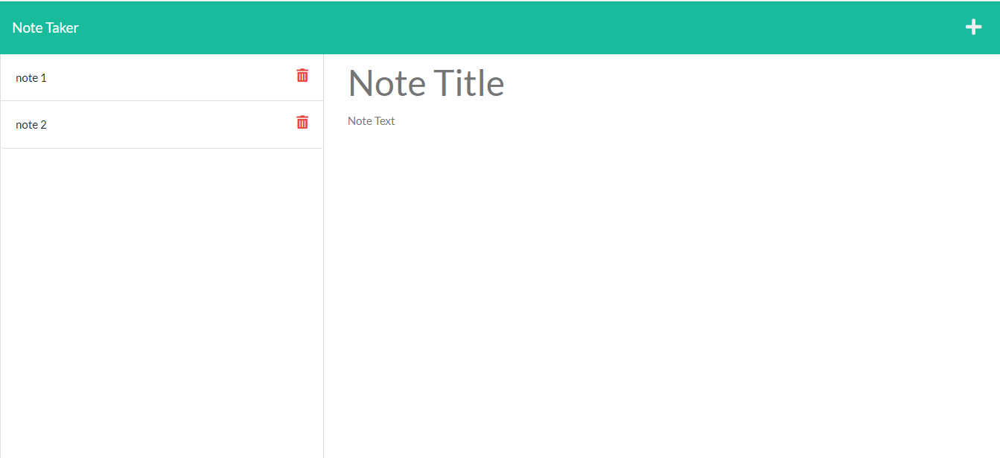

# Note Taker 
This is a note taker app that takes in user input and saves it for later use. 

## Table of Contents
- [Deployed Application](#Deployed)
- [Usage](#Usage)
- [Contributing](#Contributing)
- [Technologies](#Technologies)
- [Questions](#Questions)
- [Acknowledgments](#Acknowledgments)

## Deployed Application
This app has been deployed on Heroku Cloud Application Platform at :  
https://note-taker92380.herokuapp.com/

## Usage 
The app start with a landing page shown below:

  

When user clicks the 'Get Started' button they are directed to the main note taking page shown below:

  

When the user fills out the 'note title' and 'note text' sections a '💾' icon will appear in the top right of the page. When clicked this will save the note to the database and shown on the right hand side of the page. From there user can add as many notes as they please all showing on the right hand side. Each saved note can be clicked on to show the note title and note text on the main part of the screen. If user would like to add an additional note from there, click the '+' button at the top right to add a new note.

Each note can be deleted by cliking the red trash can icon next to the individual note title on the left of the page. 

## Contributing 
Here are the steps in order to contribute to this project.
1. **Fork** the repo on GitHub
2. **Clone** the project to your own machine
3. **Commit** changes to your own branch
4. **Push** your work back up to your fork
5. Submit a **Pull Request** so that we can review your changes

NOTE: Be sure to merge the latest from `main` before making a pull request!

## Technologies
- JavaScript
- CSS
- HTML
- Node.JS
- Express and uuid 3rd party modules 
- Deployed on Heroku Cloud Application Platform
- Uses Nodemon as a dev dependancy for easier development  

## Questions
Please refer any questions or problem issues to bhoff1980@gmail.com.

## Acknowledgments
Andres Jimenez (Tudor)  
Kirtley Adams (Teaching Assistant)  
Dan Kaltenbaugh (Instructor) 
George Yoo (Teaching Assisstant)